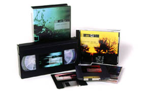

# cheng2.com archive

Samples from Cheng2 Designs archived portfolio ([video demo](https://www.youtube.com/watch?v=h2rdDYZ_3bY)).

## Interactive Projects
#### [Nike Team Sports](nike): suite of uniform builders for basketball, baseball, football, camp series

 

#### [Refractec](refractec): eye surgery equipment tutorial for Ignite Health

 

#### [Ofivina 01](ofivina.cd): cd-rom commemorating Ofivina arts exhibit & festival

 

## Websites

 
 
 

## Logos

## Print Layout

   

## Publications
- [Ancient Resumé](resume-2002.pdf)
- Saw, Cheng Cheng (1993) [Customized 3-D Electropalatography Display](http://phonetics.linguistics.ucla.edu/facilities/physiology/epg.html). UCLA Working Papers in Phonetics, 85, 71-96.
- D. Byrd, E. Flemming, C. A. Mueller, & C. C. Tan. (1995) [Using regions and indices in EPG data reduction](https://github.com/ccstan99/cheng2-archive/blob/main/samples/1995%20jshr38%20-%20Using%20Regions%20and%20Indices%20in%20EPG%20Data%20Reduction.pdf). Journal of Speech and Hearing Research, 38:821-827.
- D. Byrd & C. C. Tan. (1996) [Saying consonant clusters quickly](https://github.com/ccstan99/cheng2-archive/blob/main/samples/1996%20JPhon%20-%20Saying%20consonant%20clusters%20quickly.pdf). Journal of Phonetics, 24(2):263-282.